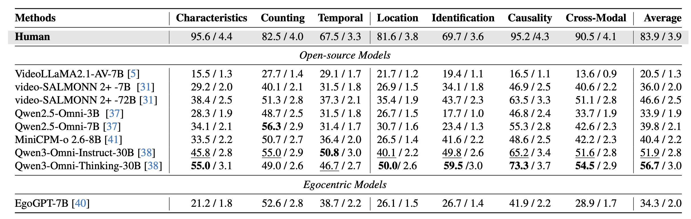

# EgoSound (CVPR 2026)

## EgoSound: Benchmarking Sound Understanding in Egocentric Videos

Official release of the paper:

**EgoSound: Benchmarking Sound Understanding in Egocentric Videos**  
📄 **[paper](https://arxiv.org/abs/2602.14122)**


---

## Overview

We introduce **EgoSound**, the first benchmark designed to systematically evaluate **egocentric sound understanding** in Multimodal Large Language Models (MLLMs).

EgoSound unifies data from **Ego4D** and **EgoBlind**, covering both sighted and sound-dependent experiences. The benchmark defines a **seven-task taxonomy**, spanning:

- Intrinsic sound perception  
- Spatial localization  
- Causal inference  
- Cross-modal reasoning  

Constructed through a multi-stage auto-generative pipeline, EgoSound contains:

- **7,315 validated QA pairs**
- **900 egocentric videos**

Comprehensive experiments on nine state-of-the-art MLLMs demonstrate that while current models exhibit emerging auditory reasoning abilities, they remain limited in fine-grained spatial and causal understanding.

EgoSound establishes a challenging foundation for advancing multisensory egocentric intelligence, bridging the gap between *seeing* and truly *hearing* the world.

---


---

## Benchmark Results

We evaluate multiple state-of-the-art MLLMs on EgoSound. The benchmark results are shown below:



---

## Supported Models

We provide evaluation code to reproduce our experimental results.

Currently supported models:

- EgoGPT-7B  
- VideoLLaMA2.1-AV-7B  
- MiniCPM-o 2.6-8B  
- Qwen2.5-Omni  
- Qwen3-Omni  

---

# Reproducing Evaluation

## Step 0: Preparation

**Prepare Data:**

1. download preprocessed egoblind and ego4d video clips and question-answer annotations from huggingface [data](https://huggingface.co/datasets/grooLegend/EgoSound)
* make sure the directory layout is :
```text
data
  └── EgoBlind
  |      └── videos
  |      |       ├── *.mp4
  |      |       ├── ...
  |      └── audios
  |              ├── *.wav
  |              ├── ...
  |
  └── EgoBlind
  |      └── videos
  |      |       ├── *.mp4
  |      |       ├── ...
  |      └── audios
  |              ├── *.wav
  |              ├── ...
  |
  ├── egoblind.json
  ├── ego4d.json
```

2. Download Model checkpoint for the target MLLM
[EgoGPT-7b-EgoIT-EgoLife](https://huggingface.co/lmms-lab/EgoGPT-7b-EgoIT-EgoLife),
[MiniCPM-o-2_6](https://huggingface.co/openbmb/MiniCPM-o-2_6),
[Qwen3-Omni-30B-A3B-Thinking](https://huggingface.co/Qwen/Qwen3-Omni-30B-A3B-Thinking),
[Qwen2.5-Omni-3B](https://huggingface.co/Qwen/Qwen2.5-Omni-3B),
[VideoLLaMA2.1-7B-AV](https://huggingface.co/DAMO-NLP-SG/VideoLLaMA2.1-7B-AV),
---

## Step 1: Inference

### 1.1 Configure 

Edit `config.yaml` to specify:

- Path to mllm checkpoint 
- Output path  
- Model name  
- Path to the question-answer annotation file you download on huggingface 

For **VideoLLaMA2**, you must additionally specify the modality:
- `audio`
- `video`
- `audio-video`

---

### 1.2 Run Inference

Run all models defined in `config.yaml`:

```bash
python infer.py
```

Run a specific model:

```bash
# EgoGPT
python infer.py --only egogpt_av

# MiniCPM
python infer.py --only minicpm_av

# Qwen2.5-Omni
python infer.py --only qwen25_omni

# VideoLLaMA2
python infer.py --only videollama2_av

# Qwen3-Omni Thinking
python infer.py --only qwen3_omni_thinking
```
The inference stage generates answer.json.

## Step 2: Evaluation

We use **GPT-5 as a judge** to automatically evaluate model predictions.

Depending on the format of answer.json, use the appropriate interface.
### Format A (VideoLLaMA-style)
```json
{
  "question": "...",
  "answer": "...",
  "pred": "..."
}
```

Run:
```bash
python qa_eval_gpt.py --answer_path "YOUR_PATH" --style videollama
```

### Format B (VideoSalmonn-style)
```json
{
    "prompt": {
        "value": "some header\nreal question text"
    },
    "ref": "...",
    "pred": "..."
}
```

Run:
```bash
python qa_eval_gpt.py --answer_path "YOUR_PATH" --style videosalmonn
```

## Citation
If you find our benchmark or code useful for your research, please consider citing:
```bibtex
@misc{zhu2026egosoundbenchmarkingsoundunderstanding,
      title={EgoSound: Benchmarking Sound Understanding in Egocentric Videos}, 
      author={Bingwen Zhu and Yuqian Fu and Qiaole Dong and Guolei Sun and Tianwen Qian and Yuzheng Wu and Danda Pani Paudel and Xiangyang Xue and Yanwei Fu},
      year={2026},
      eprint={2602.14122},
      archivePrefix={arXiv},
      primaryClass={cs.CV},
      url={https://arxiv.org/abs/2602.14122}
}
```

## License
This project is released under the MIT License.
