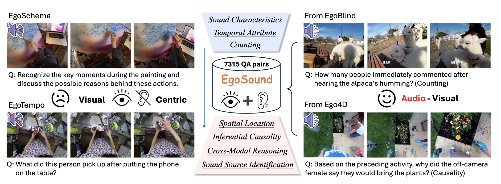
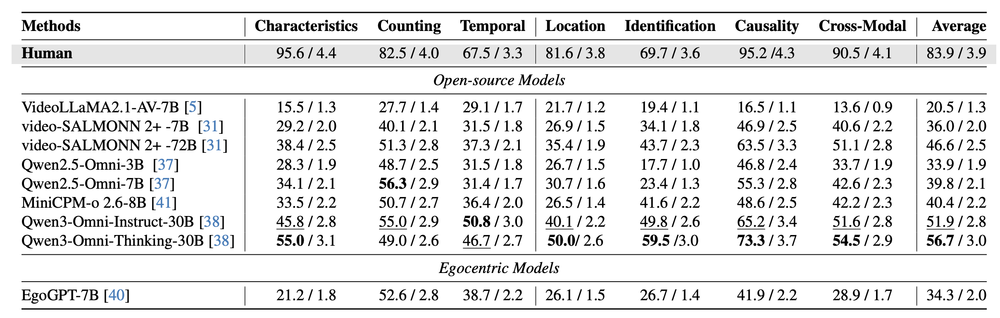

## [CVPR2026] EgoSound: Benchmarking Sound Understanding in Egocentric Videos

[News: Feb 26] Our Paper is accepted by CVPR2026! 🎉

[News: Feb 26] We release our: 📄 **[paper](https://arxiv.org/abs/2602.14122)**, 👐 **[huggingface](https://huggingface.co/datasets/grooLegend/EgoSound)**, 🌍 **[website page](https://groolegend.github.io/EgoSound/)** Please check them out! 🔥🔥🔥

---

## Overview

We introduce **EgoSound**, the first benchmark designed to systematically evaluate **egocentric sound understanding** in Multimodal Large Language Models (MLLMs).

EgoSound unifies data from **Ego4D** and **EgoBlind**, covering both sighted and sound-dependent experiences. Constructed through a multi-stage auto-generative pipeline, EgoSound contains:

- **7,315 validated QA pairs**
- **900 egocentric videos**

EgoSound establishes a challenging foundation for advancing multisensory egocentric intelligence, bridging the gap between *seeing* and truly *hearing* the world.

---



---

## Benchmark Results

We evaluate multiple state-of-the-art MLLMs on EgoSound. The benchmark results are shown below:



---

## Supported Models

We provide evaluation code to reproduce our experimental results.

| Model                  | Inference | Evaluation |
|------------------------|-----------|------------|
| EgoGPT-7B              | ✔         | ✔          |
| VideoLLaMA2.1-AV-7B    | ✔         | ✔          |
| MiniCPM-o 2.6-8B       | ✔         | ✔          |
| Qwen2.5-Omni           | ✔         | ✔          |
| Qwen3-Omni             | ✔         | ✔          |
| Video-SALMONN-2        | ✖         | ✔          |


**For Video-Salmonn, we only provide the evaluation code. Please refer to its official repository for inference：[github](https://github.com/bytedance/video-SALMONN-2)**


---

# Reproducing Evaluation

## Step 1: Preparation

**Prepare Data:**

0. clone the repository
   
```bash
git clone https://github.com/groolegend/EgoSound.git
cd EgoSound
```  
1. download preprocessed egoblind and ego4d video clips and question-answer annotations from huggingface [data](https://huggingface.co/datasets/grooLegend/EgoSound)
* make sure the directory layout is :
```text
EgoSound
  └── Ego4d
  |      └── videos
  |      |       ├── *.mp4
  |      |       ├── ...
  |      └── audios
  |              ├── *.wav
  |              ├── ...
  |
  └── EgoBlind
  |      └── videos
  |      |       ├── *.mp4
  |      |       ├── ...
  |      └── audios
  |              ├── *.wav
  |              ├── ...
  |
  ├── egoblind.json
  ├── ego4d.json
```

2. Download the model checkpoint for the target MLLM and follow the official repository to set up the required environment.

   
   We recommend creating a separate virtual environment for each model to avoid dependency conflicts.


    [EgoGPT-7b-EgoIT-EgoLife](https://huggingface.co/lmms-lab/EgoGPT-7b-EgoIT-EgoLife),
    [MiniCPM-o-2_6](https://huggingface.co/openbmb/MiniCPM-o-2_6),
    [Qwen3-omni](https://github.com/QwenLM/Qwen3-Omni),
    [Qwen2.5-omni](https://github.com/QwenLM/Qwen2.5-Omni),
    [VideoLLaMA2.1-7B-AV](https://huggingface.co/DAMO-NLP-SG/VideoLLaMA2.1-7B-AV),
    [Video-SALMONN-2](https://github.com/bytedance/video-SALMONN-2),
---

## Step 2: Inference

### 2.1 Configure 

Edit `config.yaml` to specify:

- Path to mllm checkpoint 
- Output path  
- Model name  
- Path to the question-answer annotation file you download on huggingface 

For **VideoLLaMA2**, you must additionally specify the modality:
- `audio`
- `video`
- `audio-video`

---

### 2.2 Run Inference
We provide multi-GPU parallel inference scripts to accelerate large-scale evaluation.


Run all models defined in `config.yaml`:

```bash
python infer.py --num-gpus 8
```
We recommend creating a separate virtual environment for each model to avoid dependency conflicts.

Run a specific model:

```bash
# EgoGPT
python infer.py --only egogpt_av --num-gpus 8

# MiniCPM
python infer.py --only minicpm_av --num-gpus 8

# Qwen2.5-Omni
python infer.py --only qwen25_omni --num-gpus 8

# VideoLLaMA2
python infer.py --only videollama2_av --num-gpus 8

# Qwen3-Omni Thinking
python infer.py --only qwen3_omni_thinking --num-gpus 8
```
The inference stage generates answer.json.

## Step 3: Evaluation

We use **GPT-5 as a judge** to automatically evaluate model predictions.

Similar to the inference stage, we also provide multi-GPU parallel evaluation scripts for faster processing.


For all models listed above (except Video-SALMONN-2), the generated answers should follow the format below:
```json
{
  "question": "...",
  "answer": "...",
  "pred": "..."
}
```
To evaluate the predictions,run:
```bash
python qa_eval_gpt.py --answer_path "YOUR_PATH" --style videollama
```

for video-SALMONN2, its answers should follow the format below:

```json
{
    "prompt": {
        "value": "some header\nreal question text"
    },
    "ref": "...",
    "pred": "..."
}
```
To evaluate its predictions,run:
```bash
python qa_eval_gpt.py --answer_path "YOUR_PATH" --style videosalmonn
```

## Citation
If you find our work helpful, please consider citing our paper and staring our repo:
```bibtex
@inproceedings{zhu2026egosound,
  title={EgoSound: Benchmarking Sound Understanding in Egocentric Videos},
  author={Zhu, Bingwen and Fu, Yuqian and Dong, Qiaole and Sun, Guolei and Qian, Tianwen and Wu, Yuzheng and Paudel, Danda Pani and Xue, Xiangyang and Fu, Yanwei},
  booktitle={Proceedings of the IEEE/CVF Conference on Computer Vision and Pattern Recognition (CVPR)},
  year={2026}
}
```

## License
This project is released under the MIT License.
